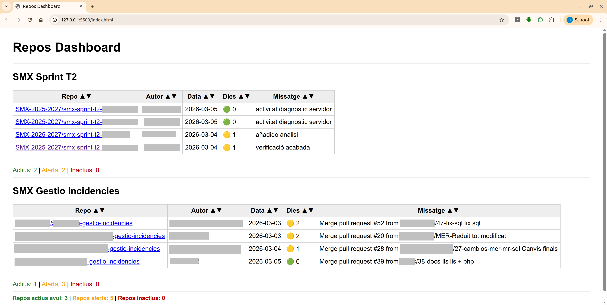

# Repos Dashboard


Dashboard local per monitoritzar l'activitat de repositoris GitHub d'alumnes.



Permet obtenir una visió ràpida de:

- activitat recent dels repositoris
- dies des de l’últim commit
- repos actius / alerta / inactius
- agrupació per projectes o activitats

Aquest projecte s'utilitza principalment per al seguiment de treballs d'alumnes en projectes de programació.

Aquest projecte està pensat per executar-se localment.  
No publicar el token GitHub utilitzat per accedir a repositoris privats.

---

## Característiques

- Consulta l'activitat dels repos mitjançant l'API de GitHub
- Detecta repos sense activitat recent
- Comptadors globals i per projecte
- Ordenació per qualsevol columna
- Dashboard lleuger (HTML + JS)
- Pensat per executar-se localment

---

## Estructura del projecte

```text
repos-dashboard
│
├── css/
│   └── style.css
│
├── data/
│   └── repos.json
│
├── js/
│   ├── script.js
│   └── config.js (ignorat per git)
│
├── index.html
└── README.md
```

---

## Configuració

### 1. Crear token GitHub

Crear un token personal a:

https://github.com/settings/tokens

Permisos necessaris:

```text
repo
```

---

### 2. Crear fitxer `config.js`

Aquest fitxer **no es versiona** (està al `.gitignore`).

```bash
js/config.js
```

Contingut:

```js
const GITHUB_TOKEN = "your_token_here";
```

---

### 3. Configurar repositoris

Editar:

```bash
data/repos.json
```

Exemple:

```json
{
  "SMX Sprint T2": [
    "SMX-2025-2027/smx-sprint-t2-arturo-reverte",
    "SMX-2025-2027/smx-sprint-t2-reverte-arturo"
  ],

  "Gestio Incidencies": [
    "perico-palotes/cog1-cog3-gestio-incidencies"
  ]
}
```

Format:

```bash
owner/repository
```

---

## Execució

Executar el projecte amb qualsevol servidor local.

Per exemple amb **VSCode Live Server** o:

```python
python3 -m http.server
```

i obrir:

```text
http://localhost:8000
```

---

## Project goals

Aquest projecte vol ser una eina lleugera per monitoritzar
l'activitat de repositoris d'alumnes utilitzant l'API de GitHub.

---

## Workflow de desenvolupament

El projecte segueix un flux de treball basat en **Pull Requests**.

### Branques

```bash
main → codi estable
feature/* → noves funcionalitats
```

### Flux de treball

1. Crear branca de funcionalitat

    ```bash
    git checkout -b feature/nova-funcionalitat
    ```

1. Desenvolupar i fer commits

    ```bash
    git add .
    git commit -m "Add new feature"
    ```

1. Pujar la branca

    ```bash
    git push -u origin feature/nova-funcionalitat
    ```

1. Crear Pull Request cap a `main`

---

## Development Workflow

Aquest repositori utilitza un flux de treball basat en **feature branches i Pull Requests**.

La branca `main` està protegida i no s'hi fan commits directes.

### Estratègia de branques

```bash
main → branca estable

feature/* → noves funcionalitats
fix/* → correccions
```

### Flux de treball

1. Actualitzar `main`

    ```bash
    git checkout main
    git pull
    ```

1. Crear una nova branca de funcionalitat

    ```bash
    git checkout -b feature/nom-de-la-funcionalitat
    ```

1. Desenvolupar i fer commits

    ```bash
    git add .
    git commit -m "Describe the change"
    ```

1. Pujar la branca al remot

    ```bash
    git push -u origin feature/nom-de-la-funcionalitat
    ```

1. Crear el Pull Request

    ```bash
    gh pr create --editor
    ```

1. Fer el merge del PR

    ```bash
    gh pr merge --squash --admin
    ```

1. Netejar la branca local

    ```bash
    git checkout main
    git pull
    git branch -d feature/nom-de-la-funcionalitat
    ```

1. Esborrar la branca remota

    ```bash
    git push origin --delete feature/nom-de-la-funcionalitat
    ```

### Notes

- `main` és sempre la versió estable del projecte.
- Les noves funcionalitats es desenvolupen en branques `feature/*`.
- Els canvis s'integren a `main` mitjançant Pull Requests.

Aquest flux de treball permet mantenir l'historial net i facilita la revisió dels canvis.

--

## Futures millores

Possibles evolucions del dashboard:

- anàlisi de contributors per repositori
- commits dels últims 7 dies
- detecció automàtica de repos d'una organització
- gràfics d'activitat
- vista per alumne

---

## Autor

Joan Pardo